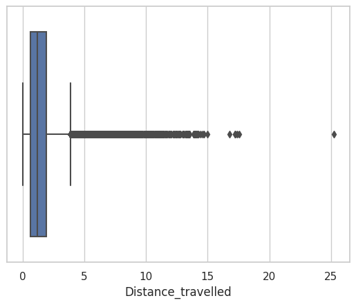
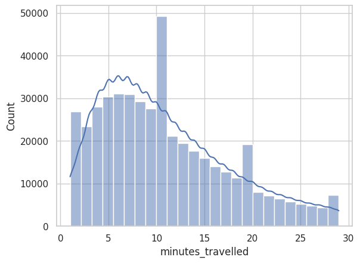
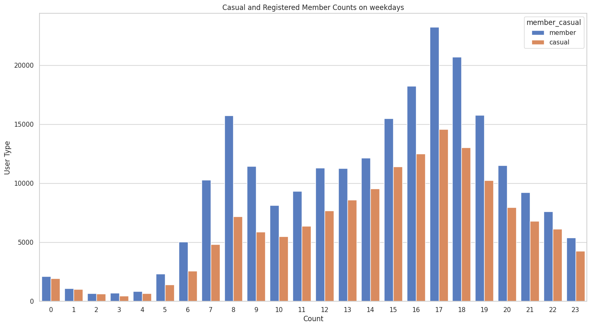
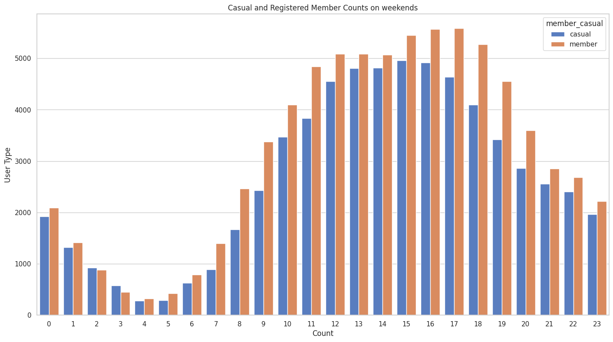
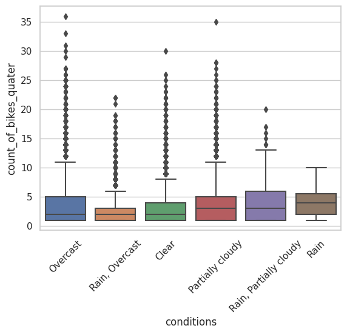
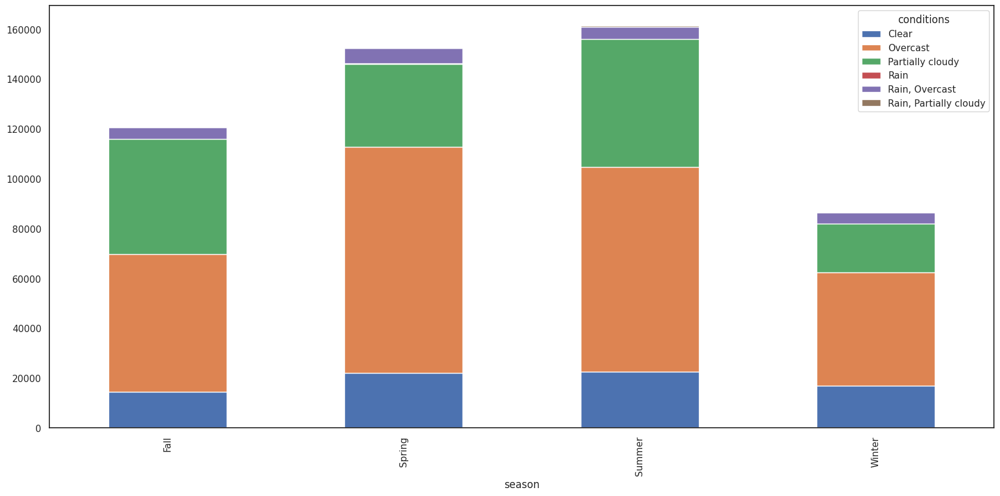
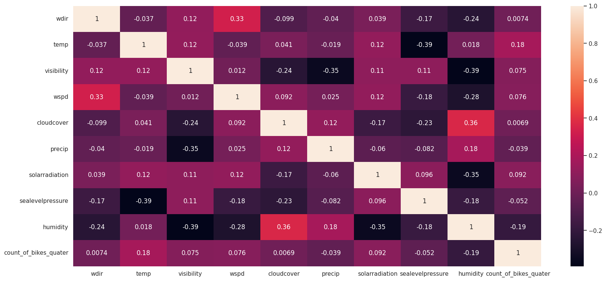
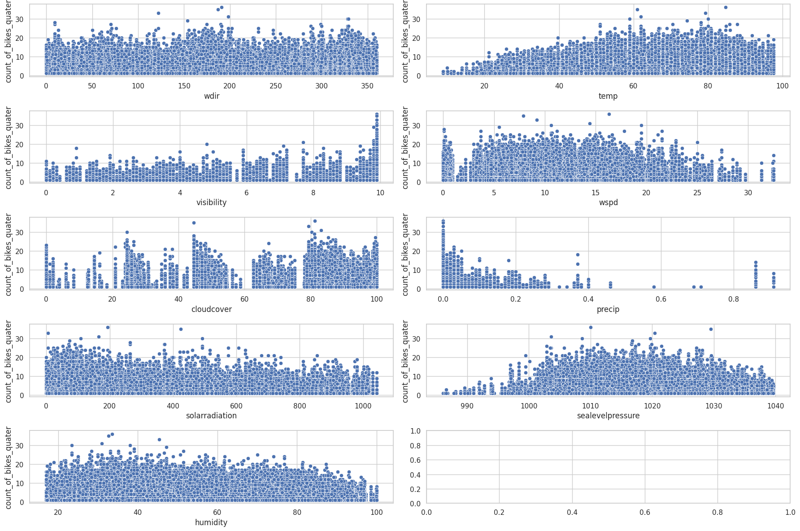
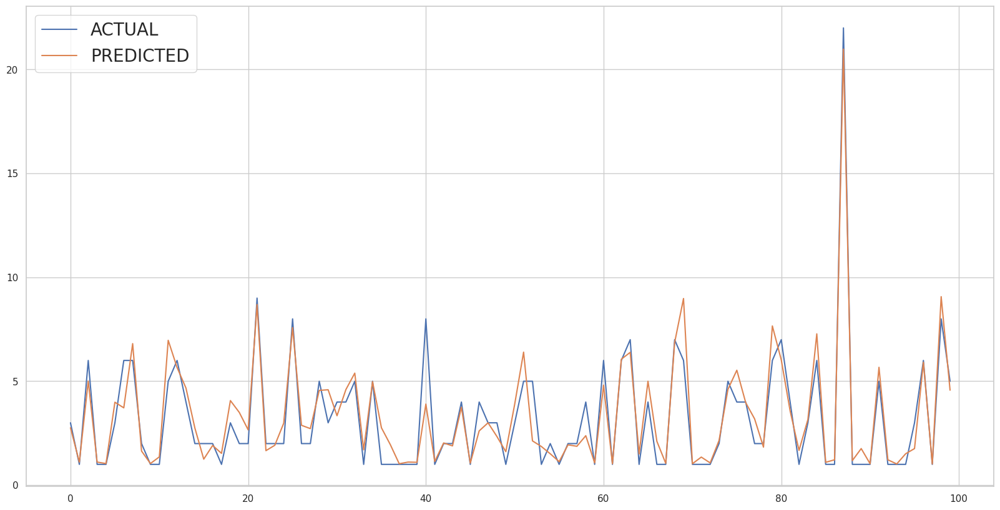

# Predicting Electric Bike Usage in the D.C. area using weather data: A machine learning approach

## Vinay Kota

And

## Sanathkumar Chiluveru

### [GitHub Repo Link](https://github.com/Vinaykota81/Data606CapstoneProject)

***Abstract***

*Electric bikes have become a popular mode of transport due to their
ease of use and environment-friendly nature. Many cities in the U.S.
have already established E-bike sharing programs that are available for
a certain rent for the consumers. These E-bikes are very convenient as
you could pick them up anywhere and park them anywhere necessary. Due to
the increasing demand, companies need to understand usage patterns.
Capital Bikeshare, a bike rental company operating in Washington D.C. by
the company LYFT is a popular one. Every year CaBi users rent bikes over
1 million times. Because of this constant demand, the company must
understand how people are renting bikes and what factors are affecting
the rentals. This project aims to analyze this issue. This project
couples Cabi’s data and the Washington D.C. weather data. We collected
the rental data from Capital Bikeshare for the year 2022 along with the
weather data from an API Visual Crossing. We performed feature
engineering to add additional features to the dataset.*

**Introduction**

With the increase in awareness among the people regarding the effects of
pollution caused due to fuel vehicles, people are more than interested
in looking for alternate options for their daily commute. One such way
is to use bikes. Big cities in the USA have been taking initiatives to
launch more and more electric bikes in highly populated cities with many
industries. Bike sharing provides various convenient factors such as
different pickup and drop-off locations. You could be able to simply
rent it using your mobile phone and an app. Capital Bikeshare has an app
where users can select if they want to be a member or just need a
one-time ride. It provides flexible plans for a mass commute. The bikes
can be used as a one-way transport or two ways \[1\].

With all these use cases and advantages that these bike-sharing programs
have, it is becoming necessary to cope with the demand. This project
proposes a detailed analysis of the bike rentals which includes time
taken by each renter, distance covered, and minutes traveled for each
quarter hour. The paper by Egzi Eren (2020), gives some essential
factors that contribute to rental demand fluctuations. This includes
weather conditions like heat, precipitation, and snow, type of roadways,
public transport in that area, etc. Of these weather plays a prominent
role in the reduction of rental demands. This project aims to combine
the existing Cabi bike rental data with the weather to find out how can
one make informed decisions while setting up additional docks and also
putting in additional bikes in that locality \[2\].

We also aim to predict the rental demand based on the hour and also the
quarter hour in which rentals are happening. One way to find the usage
patterns is through the use of machine learning algorithms on data
gathered from bike-sharing programs. For example, Wang (2016) used data
from New York City's bike-sharing program to analyze the impact of
weather and holidays on bike rentals. The author found that variables
such as temperature, wind speed, and humidity have a significant impact
on the number of rentals and that people tend to use bikes more during
weekdays when offices are open and in the evenings on weekends. By using
machine learning algorithms, the author was able to predict the demand
for bike rentals, which could help eliminate surprises for bike rental
companies \[3\].

Another study by Gao and Chen (2020) explored the impact of pollution,
traffic, and COVID-19 on bike rental demand using data from Seoul's
bike-sharing program. The authors found that pollution, traffic
accidents, and weather variables such as visibility and humidity were
positively correlated with bike rentals, while COVID-19 cases and deaths
had a negative correlation. By using machine learning algorithms to
analyze these factors, the authors were able to identify which factors
had the most impact on bike rental demand \[4\].

Another study by Tien Dung Tran and Nicolas Ovtracht (2015), aimed to
investigate the impact of built environment factors such as land use,
population density, and transportation infrastructure on bike-sharing
demand. The research was carried out by analyzing data from a
bike-sharing system in a French city. The findings of the study revealed
that built environment factors play a significant role in bike-sharing
demand and that transportation infrastructure has the strongest
influence on bike-sharing usage \[5\]. The study concluded that
policymakers and city planners should consider these factors when
implementing bike-sharing systems in urban areas.

**Methods**

This project uses two main data sources: Capital Bikeshare rental data
and Weather data of Washington D.C.

Capital Bikeshare company has an open data portal where we could be able
to download the data from 2015 \[6\]. Here for this project, we are
choosing just the year 2022 since the number of records for that single
year is around 500k. This huge number of records is making this
substantial enough to run analytics and get information. The dataset
contains fields like the ride rideable type (electric or normal), start
time, end time, start location, end location, corresponding latitude and
longitude, rented by a registered member or casual member. In this
project, electric bikes are the area of focus.

The second is the weather data. To get Washington D.C.'s weather data,
we used an API by visual crossing \[7\]. This API provides different
weather-related fields like temperature, snow, weather conditions, etc.
The API can only retrieve data for 20 days at a time. A Python script
was created to retrieve essential data for every hour throughout the
year with around 8760 records.

The whole project was done using jupyter notebook with Python.
Additional Python libraries like pandas, matplotlib, and seaborn and
machine learning libraries like sci-kit learn are used for prediction.

The raw rental data is first collected, there are two fields with a lot
of missing values i.e., station names. This data is assumed to dock less
and renters parked them with no specific station. So, the null values
are replaced by “Not Docked”. The columns start_hour, start_quater, and
time_travelled are created to better understand the problem. There is a
statistical method called haversine distance which gives us the distance
between two points on the globe. Though it may not be reliable since
people don’t commute from point to point in a straight line, it will be
a useful factor to understand what distance a renter might cover.

There are around 750 stations in Washington D.C. which would be a
redundant task to predict demand at each station as every hour has only
1 or 2 rentals at most of the stations, we divided them into 7 clusters
using the K-Means algorithm. We are going to predict and analyze the
rental patterns based on these clusters. Since we now have hourly
weather data to add to the existing data, we chose to group by date and
hour. Additional fields like minutes traveled and distance traveled are
aggregated using group by functions and a new dataset is created.

We obtained station-wise data that was incorporated into the final data
frame based on the corresponding clusters. This additional data includes
information such as the number of available docks, the number of
disabled docks, and the number of e-bikes available at each station. To
enhance the clarity of our analysis, we have also organized the
station-wise data into clusters. This enables us to conduct a
cluster-wise analysis and identify distinct characteristics and patterns
within each cluster. By comparing e-bike availability, dock
availability, and other relevant variables across clusters, we can
uncover similarities and differences that contribute to our
understanding of the rental demand.

In this project, we employed four different types of models: Linear
Regression, KNN Regressor, Random Forest Regressor, and Gradient
Boosting Regressor. The selection of these models was based on our
understanding that ensemble methods tend to perform well on tabular
data.

To evaluate and compare the performance of these models, we utilized the
cross-validation technique with 5 folds. By using cross-validation, we
aimed to mitigate the potential bias or variance issues that can arise
from a single train-test split.

The choice of 5-fold cross-validation was based on its common usage and
effectiveness in estimating model performance while striking a balance
between computational resources and accuracy. This allowed us to assess
their performance across multiple train-test splits, providing a better
overall estimate of their generalization ability and mitigating
potential overfitting.

It is important to note that our default expectation was for the
ensemble methods (Random Forest Regressor and Gradient Boosting
Regressor) to outperform the Linear Regression and KNN Regressor models
due to their ability to capture complex relationships in the data.

**Results and Analysis**

In Washington, D.C., the bike-sharing program was initially launched in
2010, marking the beginning of a growing trend. Over the years, the
program has expanded by adding more bicycles to meet the increasing
demand. In 2018, the introduction of electric bikes into the system
provided an additional transportation option for users. These electric
bikes gained popularity due to their convenient and efficient mode of
transportation, requiring less human effort compared to traditional
bikes. As a result, the usage of electric bikes has been steadily
increasing each year.

By the year 2022, electric bikes accounted for approximately 15% of the
total bike rentals in Washington, D.C. This significant proportion
demonstrates the growing acceptance and adoption of electric bikes among
the users of the bike-sharing program.

On average, people renting
bikes in Washington, D.C. typically use them for short commutes, with
rental durations ranging from 10 to 20 minutes. The majority of rentals
fall within the range of 5 to 10 minutes, indicating that many users
rely on bike sharing as a convenient mode of transportation for
short-distance trips. This pattern of short rental durations suggests
that the bike-sharing program is well suited for quick and efficient
journeys, such as short commutes between nearby locations.

Based on the graph observations, it is evident that the majority of bike
rentals in Washington, D.C. are for distances of less than 5 miles. The
distance mentioned refers to the point to point distance between the
start and end of each rental, rather than the actual distance covered
during the ride. This finding further reinforces the notion that bike
sharing is primarily utilized for short-distance trips and serves as a
convenient transportation option for shorter commutes within the city.

During weekdays, Monday to Friday, the rental patterns exhibit distinct
peak periods. In the morning, typically between 8 am and 9 am, there is
a surge in bike rentals, coinciding with the start of office hours. This
suggests that many individuals utilize the bike-sharing service as a
means of commuting to work during the morning rush hours. Similarly, in
the evening, around 5 pm to 6 pm, there is another peak in bike rentals.
This aligns with the end of office hours, indicating that people rely on
electric bikes to travel back home after work.

Conversely, on weekends, a different trend emerges. The count of rentals
gradually increases as the day progresses, suggesting that individuals
utilize electric bikes for leisurely activities and exploration. As the
day transitions into the night, the rental count decreases, indicating
that people tend to use bikes less frequently during evening hours.

Understanding these temporal usage patterns can assist in optimizing
bike availability, station management, and resource allocation. By
aligning the distribution and availability of electric bikes with the
peak commuting hours during weekdays and adapting to the evolving rental
patterns on weekends, the bike-sharing program can better cater to the
needs of its users and enhance the overall user experience.

Analyzing the monthly statuses of electric bike usage reveals a
noticeable trend. There is a slight decline in usage after the summer
season, followed by an increase during the months of March and April.
The increase in bike usage during March and April can be attributed to
the city's renowned cherry blossom season, attracting a surge of
tourists and locals alike.

As the cherry blossoms bloom, many individuals are drawn to the scenic
beauty and cultural events associated with this time of the year.
Consequently, the demand for electric bikes rises as people opt for this
eco-friendly and convenient mode of transportation to enjoy the cherry
blossoms and explore the city.

However, as the summer months progress, the usage of electric bikes
experiences a slight decline. This may be attributed to various factors
such as increasing temperatures, vacations, or a shift in commuting
patterns due to seasonal changes. Despite the slight decrease, electric
bikes continue to serve as a popular transportation option in
Washington, D.C.

Upon analyzing the plot, a
clear pattern emerges regarding the relationship between weather
conditions and bike rentals. The majority of rentals occur when the sky
is cloudy or partially cloudy, while rentals are significantly lower
during rainy conditions. This observation suggests that weather,
particularly temperature, and cloud cover, plays a crucial role in
influencing the demand for bike rentals. During the spring and summer
months, when the weather is generally warmer, people tend to opt for
electric bikes more frequently when the sky is filled with clouds rather
than on clear days. This implies that individuals may perceive overcast
conditions as more comfortable for outdoor activities, including bike
riding. The presence of clouds likely provides shade and a cooler
environment, making it more appealing for users to engage in bike
rentals.

Interestingly, this trend holds across other seasons as well. Overcast
conditions consistently coincide with the highest number of bike
rentals, while rentals decline significantly during rainy weather

Understanding the influence of weather conditions on bike rental demand
can be valuable for operational and marketing purposes. It allows
bike-sharing programs to anticipate fluctuations in demand based on
weather forecasts and optimize resource allocation accordingly.
Additionally, it underscores the importance of considering weather
patterns and their impact on user preferences when designing marketing
campaigns and promoting bike rentals during specific weather conditions.

The correlation coefficients in the table indicate the strength and
direction of the linear relationship between each pair of variables.
Here's a summary of the observed correlations:

Temperature (temp) has a positive correlation (0.181257) with the count
of bikes rented per quarter (count_of_bikes_quater), indicating that
higher temperatures are associated with increased bike rentals.

Humidity (humidity) has a
negative correlation (-0.190753) with bike rentals, suggesting that
higher humidity levels are slightly associated with fewer rentals.

Visibility (visibility) and wind speed (wspd) have weak positive
correlations (0.074916 and 0.075996, respectively) with bike rentals,
indicating a slight influence of these factors on rental counts.

Other factors such as wind direction (dir), cloud cover (cloud cover),
precipitation (precip), solar radiation (solar radiation), and sea level
pressure (sea level pressure) show weak correlations (close to zero)
with bike rentals, suggesting a minimal impact on rental counts.

Temperature and humidity appear to be the most influential factors
affecting bike rentals, with higher temperatures and lower humidity
levels associated with increased rental activity. Other weather factors
such as visibility, wind speed, cloud cover, precipitation, solar
radiation, and sea level pressure have weaker or negligible correlations
with bike rental counts.

Based on the scatter plots depicting the relationship between weather
variables and the count of rentals, it is evident that three factors
significantly contribute to the fluctuations in bike demand:
temperature, precipitation, and solar radiation.

**Temperature:** The scatter plot shows a clear positive trend between
temperature and the count of rentals. As temperature increases, there is
a corresponding increase in bike rentals, indicating that warmer weather
attracts more people to use bikes for transportation.

**Precipitation:** The scatter plot reveals a negative relationship
between precipitation and the count of rentals. As precipitation levels
rise, the number of bike rentals decreases. This suggests that rainy
conditions deter people from renting bikes, likely due to concerns about
riding in wet weather and reduced overall convenience.

**Solar Radiation:** The scatter plot demonstrates a positive
correlation between solar radiation (sunlight intensity) and the count
of rentals. Higher levels of solar radiation coincide with increased
bike rentals, indicating that sunny conditions encourage people to
choose biking as a mode of transportation.

**  
**Given the factors considered, including weather variables and docking
station information, we chose to employ four different regression models
to compare their performance: Linear Regression, Random Forest
Regression, KNN Regression, and Gradient Boosting Regression. Based on
previous studies and recommendations, it has been suggested that Random
Forest Regression tends to yield superior results in similar contexts.

| **Model**                    | **Mean Square Error** | **Root Mean Square Error** | **R-Square Value** |
|---------------------|----------------|-------------------|----------------|
| Linear Regression            | 414.98132399574905    | 20.371090397810054         | 0.7847564616011757 |
| KNN Regression               | 4.698329088615971     | 2.167562937636638          | 0.5184173052130958 |
| Random Forest Regression     | 1.3425534877484666    | 1.1586861040629022         | 0.8623871350152861 |
| Gradient Boosting Regression | 1.372411349351133     | 1.171499615600079          | 0.8593266790148696 |

The results indicate that the Random Forest Regression model
outperformed the other models based on all three-evaluation metrics. It
achieved the lowest MSE and RMSE values, indicating better accuracy in
predicting e-bike rental demand. Additionally, it demonstrated a higher
R-Square value, suggesting that a larger proportion of the variance in
the rental demand is explained by the model's predictions. \[3\]\[4\]

These findings support previous works that have also found Random Forest
Regression to be a suitable model for predicting e-bike rental demand.
The model's ability to capture complex relationships and handle
non-linear patterns likely contributes to its superior performance in
this context.

Below is a sample graph of the correct predictions made for the 100 data
points on the test set:

**Conclusion**

In conclusion, this project has provided valuable insights into the
relationship between weather patterns and e-bike rental demand. The
findings highlight the significance of weather variables, including
temperature, precipitation, and solar radiation, in influencing the
usage patterns of e-bikes. By leveraging machine-learning techniques,
particularly the Random Forest Regression model, accurate predictions of
rental demand can be achieved.

The study has implications for companies like Capital One Bikeshare,
where integrating weather data and predictive models can optimize
resource allocation, marketing strategies, and overall operational
efficiency. These findings can inform decision-making processes and
contribute to the development of sustainable urban transportation
initiatives.

Looking ahead, prospects for this project include incorporating
additional data sources, implementing dynamic pricing strategies,
exploring integration with other mobility services, and enhancing the
user experience through technological advancements. By pursuing these
opportunities, companies can further optimize their business models and
contribute to the growth and success of e-bike rental programs.

Overall, this project emphasizes the promising potential of e-bikes in
reshaping urban transportation, reducing reliance on traditional modes
of travel, and promoting greener, more efficient alternatives. It
underscores the importance of considering weather factors and utilizing
predictive models to drive informed decision-making in the bike-sharing
industry.

**References**

\[1\] Qiu, L.-Y., & He, L.-Y. (2018). Bike sharing and the economy, the
environment, and health-related externalities. *Sustainability*,
*10*(4), 1145. https://doi.org/10.3390/su10041145

\[2\] Eren, E., & Uz, V. E. (2020). A review on bike-sharing: The
factors affecting bike-sharing demand. *Sustainable Cities and Society*,
*54*, 101882. https://doi.org/10.1016/j.scs.2019.101882

\[3\] Wang, W. (n.d.). Forecasting bike rental demand using New York
Citi Bike Data. ARROW@TU Dublin. Retrieved March 10, 2023, from
https://arrow.tudublin.ie/scschcomdis/79/

\[4\] Gao, C., & Chen, Y. (1970, January 1). Using machine learning
methods to predict demand for bike sharing. SpringerLink. Retrieved
March 10, 2023, from
https://link.springer.com/chapter/10.1007/978-3-030-94751-4_25

\[5\] Tran, T. D., Ovtracht, N., & d’Arcier, B. F. (2015). Modeling bike
sharing system using built environment factors. *Procedia CIRP*, *30*,
293–298. https://doi.org/10.1016/j.procir.2015.02.156

\[6\] https://opendata.dc.gov/

\[7\]
<https://www.visualcrossing.com/resources/documentation/weather-api/weather-api-documentation/>

\[8\] ChatGPT(chat.openai.com)

